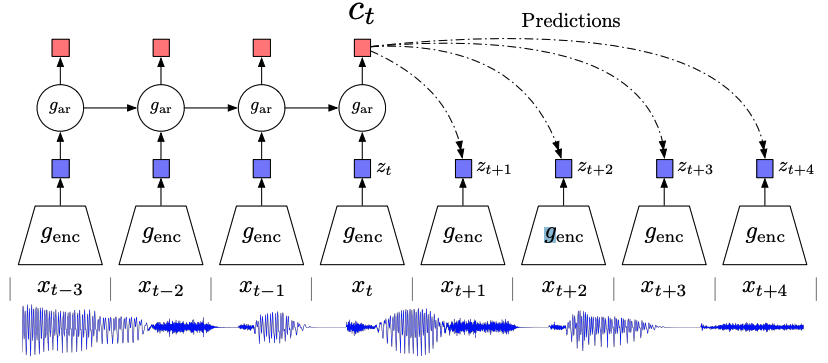

# PyFlow_CPC: 
##### Author: Talip Ucar (ucabtuc@gmail.com)

Pytorch implementation of "Representation Learning with Contrastive Predictive Coding" 
(https://arxiv.org/pdf/1807.03748.pdf).



<sup>Source: https://arxiv.org/pdf/1807.03748.pdf </sub>

# Model

<pre>
Model consists of two networks; 
      -CNN-based Encoder that generates representation z<sub>t</sub> from a given sequence (such as audio)
      -GRU-based Autoregressive model that generates context ct from z<sub>&#x2264;t</sub>

Thus, the overall, forward pass can be described in 3 steps: i) generating representations, ii) context, iii) predictions.
      i) z<sub>0:t+s</sub> = Encoder(x<sub>0:t+s</sub>)  
     ii) c<sub>t</sub> = GRU(z<sub>&#x2264;t</sub>)    
    iii) q<sub>t+i</sub> = W<sub>i</sub>c<sub>t</sub> for each time step forward, i=[1,s]

Training Objective: 
To maximize correlation between corresponding q<sub>t+i</sub> and z<sub>t+i</sub> for each i=[1,s] by maximizing diagonal of  
log(Softmax(z<sup>T</sup>q)), where q=[q<sub>t+1</sub> q<sub>t+2</sub>..q<sub>t+s</sub>]<sup>T</sup> and z =[z<sub>t+1</sub> z<sub>t+2</sub>..z<sub>t+s</sub>].


</pre>


A custom CNN-based encoder model is provided, and its architecture is defined in 
yaml file of the model ("./config/cpc.yaml"). 

Example: 
<pre>
conv_dims:                        
  - [  1, 512, 10, 5, 3, 1]       # i=input channel, o=output channel, k = kernel, s = stride, p = padding, d = dilation
  - [512, 512,  8, 4, 2, 1]       # [i, o, k, s, p, d]
  - [512, 512,  4, 2, 1, 1]       # [i, o, k, s, p, d]
  - [512, 512,  4, 2, 1, 1]       # [i, o, k, s, p, d]
  - [512, 512,  4, 2, 1, 1]       # [i, o, k, s, p, d]
  - 512
</pre>

```conv_dims``` defines first 5 convolutional layer as well as feature dimension of its output. You can change this architecture
by modifying it in yaml file. These dimensions are chosen so that we have down-sampling factor of 160 to get a feature vector for 
every 10ms of speech, also the rate of the phoneme sequence labels obtained for LibrisSpeech dataset. 


# Datasets
Following datasets are supported:
1. LibrisSpeech (train-clean-100)


# Environment - Installation
It requires Python 3.8. You can set up the environment by following three steps:
1. Install pipenv using pip
2. Activate virtual environment
3. Install required packages 

Run following commands in order to set up the environment:
```
pip install pipenv               # If it is not installed yet
pipenv shell                     # Activate virtual environment
pipenv install --skip-lock       # Install required packages. --skip-lock is optional, 
                                 # and used to skip generating Pipfile.lock file
```

# Training
You can train the model once you download LibrisSpeech dataset (train-clean-100) and place it under "./data" folder. 
The more datasets will be supported in the future.

# Evaluation
## Evaluation of the model performance
1. The model is evaluated using LibriSpeech phone and speaker classification 
2. The results are  reported on both training and test sets.

## Baseline Evaluation
1. Doing same evaluation as above using randomly initialized model (untrained)
2. Full supervised training on the same task, using same model architecture.

# Results

Results at the end of training is saved under "./results" directory. Results directory structure:

<pre>
results
    |-evaluation 
    |-training 
         |-model
         |-plots
         |-loss
</pre>

You can save results of evaluations under "evaluation" folder. At the moment, the results of 
evaluation is also printed out on the display, and not saved.

# Running scripts
## Training
To train the model using LibrisSpeech dataset, you can use following command:
```
python 0_train.py 
```
## Evaluation
Once you have a trained model, you can evaluate the model using: 

```
python 1_eval.py 
```

For further details on what arguments you can use (or to add your own arguments), you can check out "/utils/arguments.py"

# Experiment tracking
MLFlow is used to track experiments. It is turned off by default, but can be turned on by changing option in 
runtime config file in "./config/runtime.yaml"
